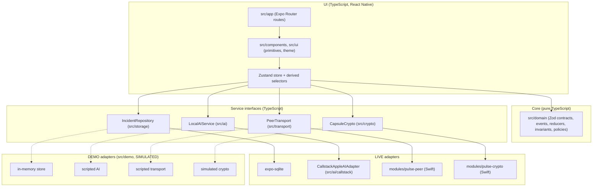

# Architecture

Status: **planned design**. None of the layers below exist in code yet (2026-10-09). This document will be corrected as each layer is implemented.

## Principles

1. Manual SOS writes to local storage first and depends on nothing else.
2. The on-device AI is reached through one adapter. Its output is always a proposal.
3. Swift is used only where no JavaScript package covers the capability: peer transport, CryptoKit and Keychain, optional motion.
4. The same screens run against two adapter bundles, LIVE and DEMO. DEMO is isolated and labelled.
5. State is derived from an append-only event ledger. Nothing is overwritten.

## Layers



## Planned repository layout

```
src/app/                  Expo Router routes: (onboarding)/, (tabs)/{index,network,activity,settings},
                          sos, incident/[id], demo-lab/, pair
src/domain/               Zod contracts, event vocabulary, reducers, invariants, policies (pure TS)
src/storage/              expo-sqlite migrations, IncidentRepository, outbox/inbox
src/ai/                   LocalAIService, prompts, schemas, error classifier, rules engine
src/ai/callstack/         CallstackAppleAIAdapter: the only code that imports @react-native-ai/apple or ai
src/transport/            PeerTransport interface, native adapter, sync, store-and-forward relay
src/crypto/               CapsuleCrypto interface, native adapter, envelope codec, disclosure policy
src/demo/                 SIMULATED adapters and scenarios, isolated store
src/ui/, src/components/  theme tokens, primitives, feature components
modules/pulse-peer/       Expo module: Network framework + Bonjour
modules/pulse-crypto/     Expo module: CryptoKit + Keychain
design/                   Claude Design export (reference only, not bundled)
docs/, .claude/agents/, CONTRIBUTING.md
```

Routes live in `src/app/`, following the Expo SDK 57 template convention. `ios/` is generated by `expo prebuild` and is not committed; all native configuration lives in `app.config.ts` and config plugins.

## TypeScript / native boundary

| Capability | Side | Package or module | Why |
| --- | --- | --- | --- |
| Text model, structured output | TypeScript via Callstack | `@react-native-ai/apple` + `ai` | Package exposes Apple Foundation Models. |
| Embeddings | TypeScript via Callstack | `apple.textEmbeddingModel()` | Package exposes `NLContextualEmbedding`. |
| Transcription | TypeScript via Callstack | `apple.transcriptionModel()` | Package exposes `SpeechAnalyzer`. |
| Text to speech (optional) | TypeScript via Callstack | `apple.speechModel()` | Package exposes `AVSpeechSynthesizer`. |
| Audio recording | TypeScript | `expo-audio` | Records to a file handed to transcription. |
| Persistence | TypeScript | `expo-sqlite` | Ledger, outbox, inbox. |
| Peer discovery and transfer | Swift | `modules/pulse-peer` | Not provided by any AI package; needs Network framework. |
| Keys, encryption, signatures | Swift | `modules/pulse-crypto` | Needs CryptoKit and Keychain. |
| Motion check-in (optional, P8) | Swift | to be decided | Needs Core Motion. |

Rules at the boundary:

- Native modules carry opaque bytes and typed events. They contain no domain logic.
- Everything that arrives from native code is validated with Zod before it reaches the domain.
- An ESLint rule (`no-restricted-imports` in `eslint.config.js`) forbids importing `@react-native-ai/apple` or `ai` anywhere under `src/` except `src/ai/callstack/`.
- No custom Swift wrapper for Foundation Models will be written while the Callstack package covers the capability.

## LIVE and DEMO adapter bundles

One set of screens; the bundle is chosen at the app root.

| | LIVE | DEMO |
| --- | --- | --- |
| Storage | SQLite on device | In-memory, separate store |
| AI | `CallstackAppleAIAdapter` | Scripted responses |
| Transport | `modules/pulse-peer` | Scripted timeline |
| Crypto | `modules/pulse-crypto` | Simulated |
| Identities | Real device identity and trusted peers | Scripted personas Alex, Mika, Noah |
| Labelling | Shows only measured states | Persistent SIMULATED banner on every screen |

DEMO will never read or write live identities, keys, incidents or queues. LIVE will never display a state it has not measured. Demo runs never produce performance numbers.

## End-to-end sequence (planned)

```mermaid
sequenceDiagram
  autonumber
  actor Alex as Reporter (A)
  participant UI as UI / store (A)
  participant Repo as IncidentRepository (A)
  participant AI as LocalAIService (A)
  participant Cr as CapsuleCrypto (A)
  participant Tx as PeerTransport
  participant B as Responder device (B)
  actor Mika as Responder (B)

  Alex->>UI: Press SOS
  UI->>Repo: transaction { append INCIDENT_CREATED; enqueue outbox row }
  Repo-->>UI: persisted (state: saved and queued)
  Note over UI,Repo: No AI, transport or permission call has happened yet.

  opt Report added
    Alex->>UI: Type or dictate report
    UI->>Repo: append REPORT_ADDED (verbatim)
  end

  opt Local AI ready on this device
    UI->>AI: extractIncidentReport(original report)
    AI-->>UI: AIResult (proposal with evidence spans, or typed failure)
    UI->>Repo: append AI_PROPOSAL_CREATED
  end

  Alex->>UI: Review recipients and disclosure
  UI->>Cr: encryptForRecipients(summary, detail, policy)
  Cr-->>UI: signed envelope (ciphertext)
  UI->>Repo: append CAPSULE_PREPARED, CAPSULE_QUEUED

  loop Until receipt or expiry
    Repo->>Tx: sendOpaquePacket(envelope)
    Repo->>Repo: append PACKET_SENT_ATTEMPT
    Tx->>B: framed bytes
    B->>B: verify signature, expiry, replay; persist
    B-->>Tx: signed receipt
    Tx-->>Repo: receipt bytes
  end
  Repo->>Repo: verify receipt; append PACKET_RECEIVED_BY_PEER; mark outbox row done
  Repo-->>UI: state: delivered

  Mika->>B: Tap Acknowledge
  B-->>Repo: RESPONDER_ACKNOWLEDGED (separate signed event)
  Repo-->>UI: state: acknowledged
```

What the sequence guarantees by construction:

- Step 2 completes before any optional step. A failure in AI, crypto or transport leaves a persisted, queued incident.
- "Delivered" is driven only by a verified receipt, never by the transport's send callback.
- "Acknowledged" is a separate human event from the responder.

## Related documents

[DOMAIN_MODEL.md](DOMAIN_MODEL.md), [LOCAL_AI.md](LOCAL_AI.md), [NETWORK_PROTOCOL.md](NETWORK_PROTOCOL.md), [SECURITY_PRIVACY.md](SECURITY_PRIVACY.md), [ADR/](ADR/).
