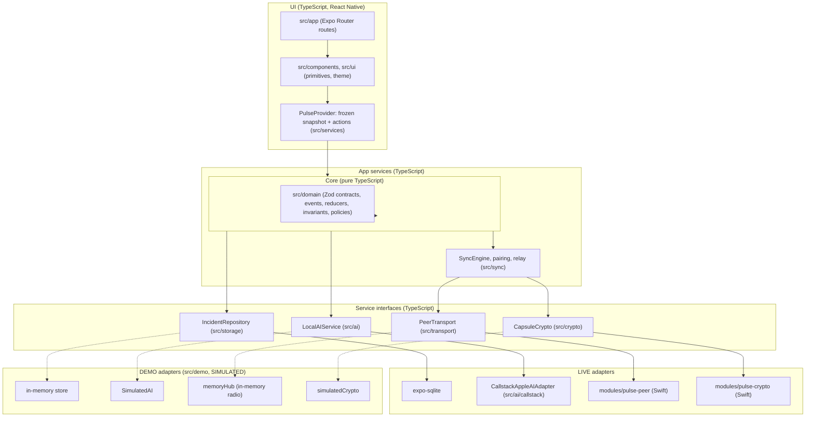

# Architecture

Status (2026-10-10): **every layer below exists in code and is unit-tested in Jest or `swift test`; none has run on a physical iPhone.** The native modules compile (EAS build `fbc85457`). The DEMO bundle has been run in the iOS 26.3 simulator; no LIVE-mode behaviour has been observed anywhere. Per-feature status and evidence are in [IMPLEMENTATION_STATUS.md](IMPLEMENTATION_STATUS.md).

## Principles

1. Manual SOS writes to local storage first and depends on nothing else.
2. The on-device AI is reached through one adapter. Its output is always a proposal.
3. Swift is used only where no JavaScript package covers the capability: peer transport, CryptoKit and Keychain, optional motion.
4. The same screens run against two adapter bundles, LIVE and DEMO. DEMO is isolated and labelled.
5. State is derived from an append-only event ledger. Nothing is overwritten.

## Layers



## Repository layout

As committed. Where the code landed somewhere other than first planned, the row says so.

```
src/app/                  Expo Router routes: (onboarding)/welcome, (tabs)/{index,network,activity,settings},
                          sos, incident/[id], incident/[id]/report, demo-lab/{index,local-ai,session}, pair
src/domain/               Zod contracts, event vocabulary, commands, reducer, policies, disclosure
                          projection, deterministic floor/building and conflict rules (pure TS)
src/storage/              SQLite migrations, IncidentRepository, outbox/inbox; expo-sqlite driver
src/ai/                   LocalAIService types, evidence check, error classifier
src/ai/callstack/         CallstackAppleAIAdapter, prompts and model-facing schemas: the only code that
                          imports @react-native-ai/apple or ai
src/transport/            PeerTransport interface, native adapter, base64
src/crypto/               CapsuleCrypto interface, native adapter, capsule sections and event tiers
src/sync/                 Packet codec, SyncEngine (send, receive, receipts, retries, relay), pairing
src/services/             Screen-facing contract (api.ts), PulseCore, createLiveApp, PulseProvider
src/demo/                 SIMULATED AI, radio and crypto, personas, world, scenarios, createDemoApp
src/ui/, src/components/  theme tokens, primitives, feature components
modules/pulse-peer/       Expo module: Network framework + Bonjour
modules/pulse-crypto/     Expo module: CryptoKit + Keychain
design/                   Claude Design export (reference only, not bundled)
docs/, .claude/agents/, CONTRIBUTING.md
```

Differences from the first plan: sync and relay are in `src/sync/`, not `src/transport/`; the disclosure policy and the rules engine are in `src/domain/`, not `src/crypto/` and `src/ai/`; `src/services/` was added as the layer the screens talk to. Zustand is used only for small UI state (the live/demo switch, toasts, the simulated safety session); app state reaches the screens as one frozen snapshot through `PulseProvider`.

Routes live in `src/app/`, following the Expo SDK 57 template convention. `ios/` is generated by `expo prebuild` and is not committed; all native configuration lives in `app.config.ts` and config plugins.

## TypeScript / native boundary

| Capability | Side | Package or module | Why |
| --- | --- | --- | --- |
| Text model, structured output | TypeScript via Callstack | `@react-native-ai/apple` + `ai` | Package exposes Apple Foundation Models. |
| Embeddings | TypeScript via Callstack | `apple.textEmbeddingModel()` | Package exposes `NLContextualEmbedding`. |
| Transcription | TypeScript via Callstack | `apple.transcriptionModel()` | Package exposes `SpeechAnalyzer`. |
| Text to speech (optional) | TypeScript via Callstack | `apple.speechModel()` | Package exposes `AVSpeechSynthesizer`. |
| Audio recording | TypeScript | `expo-audio` | Records to a file handed to transcription. |
| Persistence | TypeScript | `expo-sqlite` | Ledger, outbox, inbox. |
| Peer discovery and transfer | Swift | `modules/pulse-peer` | Not provided by any AI package; needs Network framework. |
| Keys, encryption, signatures | Swift | `modules/pulse-crypto` | Needs CryptoKit and Keychain. |
| Motion check-in (optional, P8) | Swift | to be decided | Needs Core Motion. NOT STARTED. |

Rules at the boundary:

- Native modules carry opaque bytes and typed events. They contain no domain logic.
- Everything that arrives from another device is validated with Zod before it reaches the domain: the packet (`src/sync/packet.ts`), the opened sections (`src/crypto/capsule.ts`) and each event (`src/domain/`).
- An ESLint rule (`no-restricted-imports` in `eslint.config.js`) forbids importing `@react-native-ai/apple` or `ai` anywhere under `src/` except `src/ai/callstack/`.
- A second ESLint rule forbids app code from importing `**/testing/*` helpers.
- No custom Swift wrapper for Foundation Models is written while the Callstack package covers the capability. None exists.

## LIVE and DEMO adapter bundles

One set of screens; the bundle is chosen at the app root (`src/components/AppRoot.tsx`), which calls `createLiveApp()` or `createDemoApp()` from `src/services` and disposes the one it replaces. The app starts in LIVE; Demo is entered from Demo Lab or from "Explore Demo" on the welcome screen.

| | LIVE | DEMO |
| --- | --- | --- |
| Composition | One `PulseCore` on real adapters | Three `PulseCore`s (Alex, Mika, Noah) joined by the simulated radio; the screens show one of them |
| Storage | SQLite on device (`expo-sqlite`), plus `expo-sqlite/kv-store` | In-memory repositories and key-value stores |
| AI | `CallstackAppleAIAdapter` | `SimulatedAI` (keyword extraction; `source: 'simulated'`, latency 0) |
| Transport | `modules/pulse-peer` | `memoryHub` with link and fault switches |
| Crypto | `modules/pulse-crypto` | `simulatedCrypto` (enforces access; not cryptography) |
| Identities | Real device identity and trusted peers | Scripted personas Alex, Mika, Noah |
| Labelling | Shows only measured states | Persistent SIMULATED bar above every screen |
| Run so far | Not observed anywhere | Jest (`src/demo/__tests__`), and the iOS 26.3 simulator |

LIVE and DEMO share no storage, no identity and no adapters. LIVE must not display a state it has not measured. Demo runs never produce performance numbers. Known gap: sheets and dialogs use React Native `Modal`, which covers the SIMULATED bar while they are open.

## End-to-end sequence

This is the flow the code implements. It is exercised in Jest with several cores on the in-memory radio and the simulated crypto (`src/services/__tests__/`), and has not run between two phones. In the diagram, "UI / store" is the screens plus `PulseCore`, and the send loop is `SyncEngine`. A new SOS queues a basic alert straight away for every trusted peer above the `relay` level; the recipient review governs the restricted detail. Envelopes are sealed at send time from the current ledger, not when the capsule is prepared.

```mermaid
sequenceDiagram
  autonumber
  actor Alex as Reporter (A)
  participant UI as UI / store (A)
  participant Repo as IncidentRepository (A)
  participant AI as LocalAIService (A)
  participant Cr as CapsuleCrypto (A)
  participant Tx as PeerTransport
  participant B as Responder device (B)
  actor Mika as Responder (B)

  Alex->>UI: Press SOS
  UI->>Repo: transaction { append INCIDENT_CREATED; enqueue outbox row }
  Repo-->>UI: persisted (state: saved and queued)
  Note over UI,Repo: No AI, transport or permission call has happened yet.

  opt Report added
    Alex->>UI: Type or dictate report
    UI->>Repo: append REPORT_ADDED (verbatim)
  end

  opt Local AI ready on this device
    UI->>AI: extractIncidentReport(original report)
    AI-->>UI: AIResult (proposal with evidence spans, or typed failure)
    UI->>Repo: append AI_PROPOSAL_CREATED
  end

  Alex->>UI: Review recipients and disclosure
  UI->>Cr: encryptForRecipients(summary, detail, policy)
  Cr-->>UI: signed envelope (ciphertext)
  UI->>Repo: append CAPSULE_PREPARED, CAPSULE_QUEUED

  loop Until receipt or expiry
    Repo->>Tx: sendOpaquePacket(envelope)
    Repo->>Repo: append PACKET_SENT_ATTEMPT
    Tx->>B: framed bytes
    B->>B: verify signature, expiry, replay; persist
    B-->>Tx: signed receipt
    Tx-->>Repo: receipt bytes
  end
  Repo->>Repo: verify receipt; append PACKET_RECEIVED_BY_PEER; mark outbox row done
  Repo-->>UI: state: delivered

  Mika->>B: Tap Acknowledge
  B-->>Repo: RESPONDER_ACKNOWLEDGED (separate event, in a signed envelope)
  Repo-->>UI: state: acknowledged
```

What the sequence guarantees by construction:

- Step 2 completes before any optional step. A failure in AI, crypto or transport leaves a persisted, queued incident.
- "Delivered" is driven only by a verified receipt, never by the transport's send callback.
- "Acknowledged" is a separate human event from the responder.

Events are not signed one by one; they are authenticated by the signed envelope they arrive in. See [SECURITY_PRIVACY.md](SECURITY_PRIVACY.md) for what that does and does not prevent.

## Related documents

[DOMAIN_MODEL.md](DOMAIN_MODEL.md), [LOCAL_AI.md](LOCAL_AI.md), [NETWORK_PROTOCOL.md](NETWORK_PROTOCOL.md), [SECURITY_PRIVACY.md](SECURITY_PRIVACY.md), [ADR/](ADR/).
